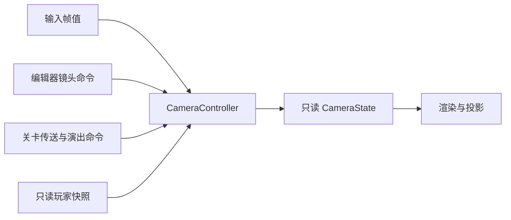

# 第 3–6 步：状态分组、控制入口、帧调度与生命周期

本文件记录当前实现；`StateOwnership.md` 保留最初的字段盘点和迁移来源。`UserState` 现在只作为 Application 的组合根，不再继承 `GameplayState`，也不再作为通用可写参数传给各个系统。

## 状态与所有者

| 分组 | 所有者及写入方式 | 场景重开 |
| --- | --- | --- |
| `gameFlow` | GameFlowController，命令与重载完成协议 | 保留进行中的重载事务 |
| `player` / `PlayerState` | PlayerController；外界只有 `const State()` | 重置生命、能力、统计和运动快照 |
| `camera` / `CameraState` | CameraController；外界发送模式、镜头及接管命令 | 重置镜头、接管和平滑历史 |
| `level` | 当前关卡；收集、电台和传送表现等本局数据 | 重置 |
| `preferences` | 已应用的游戏偏好，例如提示显示 | 保留 |
| `render` | 用户画质、后处理与渲染设置 | 保留 |
| `renderOverrides` | 关卡的临时环境覆盖，目前是 IBL | 清除，恢复用户偏好 |
| `capabilities` | 渲染设备能力，UI 只读 | 保留 |
| `renderStats` | 渲染统计，UI 只读 | 清零后重新计算 |
| `editor` | 编辑器面板、视口模式与工具状态 | 保留工作区；清场景粒子选择和悬停 |
| `runtimeUi` | 运行时界面的显示策略 | 保留，流程切换仍同步菜单 |

`UserState::ResetSession()` 按这些分组重置，替代整份 `UserState{}` 赋值。音量仍由 AudioSystem 单独保存恢复。历史上未接通的 `BikeTuning` 已在第 6 步移除。无消费者的旧鼠标坐标和 `wasMousing` 已移除，鼠标捕获只由 InputSystem 持有。

## 模块实际获得的权限

| 接口 | 能读写什么 |
| --- | --- |
| `GameplayState` 引用上下文 | 流程、玩家及相机命令，关卡数据和环境覆盖；游戏偏好只读，没有编辑器工作区或用户画质写权限 |
| `SceneStateView` | 只读流程、玩家、相机、渲染设置和编辑器调试参数 |
| `RendererStateView` | 玩家/关卡只读；相机命令、渲染与编辑器状态；流程和偏好引用用于转交 Runtime UI |
| `RuntimeUiStateView` | 流程命令、只读玩家、游戏偏好、界面显示；没有相机或关卡修改接口 |
| EngineUi 各面板 | 按面板传入 EditorState、RenderSettings、只读统计/能力或 CameraController；不再接收 UserState |
| GameUi HUD | 只读 PlayerState 与 EditorState |
| BikeController | PlayerController、输入和 Jolt；没有相机或编辑器状态 |
| PhysicsSystem | 不再保存从未使用的 UserState/InputSystem 指针 |

这些 view 是对 Application 所拥有对象的引用，不复制运行状态，也不拥有生命周期。重置状态值后，引用仍指向同一组成员对象。

## 玩家控制

`PlayerController` 负责死亡、复活、控制使能、能力解锁、运动快照和死亡表现计时。`Die()` 幂等，只在首次死亡时累计死亡次数；`Respawn()` 不改变游戏流程，也不能通过切换镜头调用。

BikeController 保留实际物理驱动，把踩踏历史、驱动力和转向/倾斜缓存收进私有成员。死亡、复活、传送和控制禁用通过 `motionResetRevision` 通知它清理旧驱动历史，避免复活后旧倾斜或踩踏状态重新写回。

每帧物理更新后，Application 调用 `GameScene::RefreshPlayerMotion()`，由 BikeController 发布真实位置和水平速度。死亡或演出禁用控制时仍更新运动反馈。极速判定沿用 36 m/s 阈值，由 PlayerController 派生，与相机模式无关；触发器使用玩家真实位置。

死亡特效由 Application 在允许模拟时调用 `UpdateEffects(dt)` 推进，Renderer 只读最终系数。角色倒地仍区别于整个游戏流程的 GameOver。

## 相机控制



- 基本模式是 Follow / Free。T 键与相机面板只请求模式切换，不复活玩家，也不通过模式决定能否骑行。
- Portal 临时接管镜头，完成或取消后恢复进入前的基本模式。立即传送与延迟穿越均由控制器处理，关卡提供空间变换请求。
- Cinematic 优先级最高；进入时取消旧 Portal，并保存基本镜头。演出期间普通模式请求和手动变换不能覆盖演出镜头；退出后恢复保存的镜头。关卡独立禁用/恢复玩家控制。
- 火箭胜利结束时释放演出控制，结算背景保留最后镜头；下一局由场景重置恢复默认跟随。
- `SetOrbit`、`SetFov`、`SetFreeTransform` 是编辑器的修改入口。手动 FOV 会保持，只有显式启用 Automatic FOV 才恢复距离/极速映射；Free 模式同样应用 FOV 平滑。
- `camera.cpp` 只负责把 InputSystem/视口信息转换为 `CameraInput`，以及读取 CameraState 生成渲染 uniform；相机计算不依赖 UserState、ImGui 或 Vulkan。
- 主菜单和暂停期间，编辑器仍能调整基本 Follow/Free 镜头；游戏模拟及 Portal/Cinematic 的时间保持暂停。角色在 Portal 中死亡时，游戏先取消该接管再申请死亡镜头。

关卡不再直接赋值 `camera2world`、轨道结果或相机内部计时，编辑器也只读当前输出并提交目标。

## 验证与后续边界

状态/控制器测试编译真实 CPU 实现，验证生命与镜头隔离、运动反馈、手动镜头、临时接管及会话重置；既有 UI 流程测试继续覆盖真实资源、Router 和 UIManager。

从仓库根目录运行：

```powershell
powershell -NoProfile -ExecutionPolicy Bypass -File Tests/State/run-controller-tests.ps1
powershell -NoProfile -ExecutionPolicy Bypass -File Tests/UI/run-game-flow-tests.ps1
powershell -NoProfile -ExecutionPolicy Bypass -File Tests/UI/run-runtime-ui-flow-tests.ps1
powershell -NoProfile -ExecutionPolicy Bypass -File Tests/UI/run-runtime-ui-flow-tests.ps1 -GameOnly
```

本轮验证：Debug x64 完整构建通过；状态/控制器 11 组、GameFlow 5 组、UI Editor 与 GameOnly 各 8 组通过。控制器和 UI 测试没有创建真实游戏窗口，未覆盖 GPU 实机交互验收。

## 输入路由与帧阶段

第 5 步现在由 Application 固定为四个阶段：

1. `InputSystem::Update()` 在帧起点调用 `glfwPollEvents()`，更新键盘、鼠标、滚轮和手柄快照。
2. Application 消费一次待处理的流程重载，再根据编辑器输入捕获状态设置玩家输入门禁。
3. 关卡、物理、动画、事件和 SceneManager 共享 `FrameExecution` 的模拟门禁；玩家控制只读取本帧输入。
4. Renderer、Runtime UI 和 Engine UI 始终进入呈现阶段。暂停时它们继续运行，Follow/Free 编辑器相机仍可调整；Portal/Cinematic 和世界模拟保持冻结。

编辑器在 ImGui 帧中发布 `inputCapturesKeyboard` / `inputCapturesMouse`，供下一帧路由使用。面板或文本输入获得键盘时，`BikeController`、关卡快捷操作和复活/传送输入均被屏蔽；Renderer 自己的 F1、调试和画质开关仍按编辑器捕获规则处理。玩家输入阻止与世界模拟暂停保持独立。

## 生命周期清理

第 6 步将会话状态和进程/编辑器状态分开处理：

- `ReloadCurrentScene()` 继续调用 `UserState::ResetSession()`，只重置玩家、相机、本局关卡、临时环境覆盖、渲染统计和场景选择；画质、能力、游戏偏好和编辑器布局保留。
- 输入边沿、鼠标增量、滚轮累加器和手柄快照在重载后由 `InputSystem::ResetForNewSession()` 清理，避免重开瞬间重复触发按键动作。
- 关卡检查点/电台冷却从函数静态变量改为关卡成员，并在 Init/Shutdown 中清零。渲染速度特效、传送特效时间、Runtime UI 计时、调试选中项和 HUD 平滑值在场景临时资源清理时清零。
- 删除没有消费者的 `BikeTuning` 配置及其奖励写入，避免留下看似可调但实际无效的旧入口。

验证覆盖暂停与设置组合、胜利/失败后的重开、编辑器布局和视口切换、输入边沿清理，以及重开保留画质和编辑器布局。完整 GPU 交互仍需要真实窗口验收。
