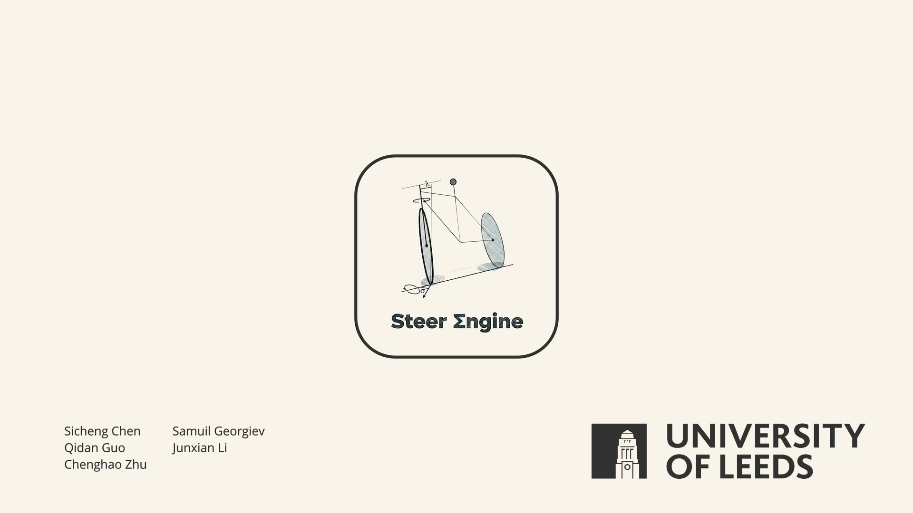

# Steer Engine

**A Performance-Focused ECS Engine for Vehicular Action Games**

Steer Engine is a custom high-performance game engine built entirely in C++. Designed from the ground up to eliminate the overhead of monolithic toolsets, it leverages the explicit graphics control of Vulkan, the rigorous data-locality of Flecs ECS, and the deterministic physical simulation capabilities of Jolt Physics. 

The engine currently powers a fast-paced bicycle action game requiring high-speed collision resolution and physics-driven mechanics.

## Core Technologies

* **Language**: C++
* **Graphics API**: Vulkan (Dynamic Rendering)
* **Architecture**: Flecs (Entity-Component-System)
* **Physics**: Jolt Physics
* **Audio**: Miniaudio
* **UI/Tooling**: Dear ImGui

## Technical Highlights

| Subsystem | Key Capabilities |
| :--- | :--- |
| **Renderer** | Physically Based Rendering (PBR), Cascaded Shadow Maps (CSM), Screen Space Reflections (SSR), SSAO, and multi-pass Bloom. |
| **Architecture** | Pure ECS paradigm ensuring high-performance entity management with negligible CPU bottlenecks and optimized memory contiguity. |
| **Physics** | Jolt Physics integration featuring a specialized Vehicle Constraint system for robust and tunable bicycle control alongside deterministic rigid-body resting states. |
| **Tooling** | Custom UI framework leveraging ImGui for real-time visibility into ECS states, rendering batches, and specialized runtime debugging. |
| **Assets & Animation** | Dynamic GLTF model loading and native support for complex humanoid skeletal animations using compute skinning and Inverse Kinematics. |

## Project Media

### Engine Showcase Video

*Click the image above to watch the full high-resolution engine showcase.*

### Academic Poster

*Click the image above to view the full PDF poster.*

### Full Technical Documentation
[Read the full Steer Engine Group Report (PDF)](./Docs/Rafael_s_Bikers-2.pdf)

***
*Developed by Sicheng Chen, Samuil georgiev, Qidan Guo, Junxian Li, and Chenghao Zhu under the supervision of Rafael Kuffner dos Anjos at the University of Leeds.*
